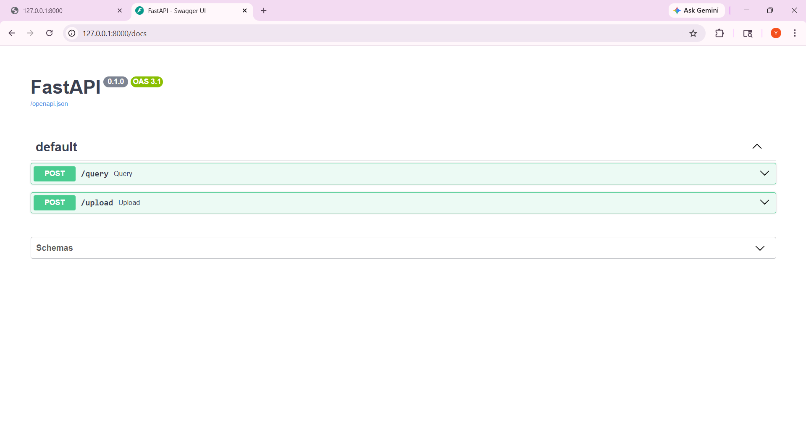
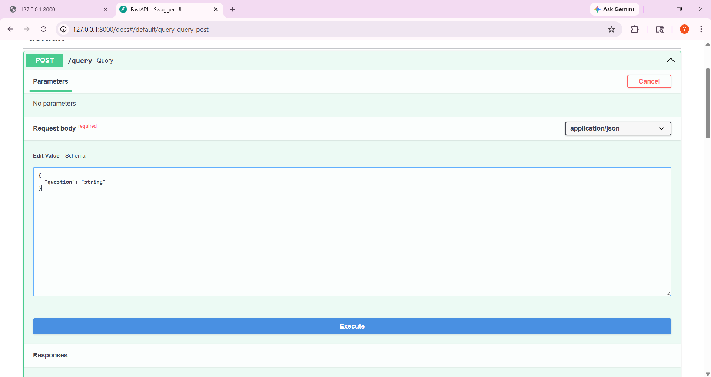
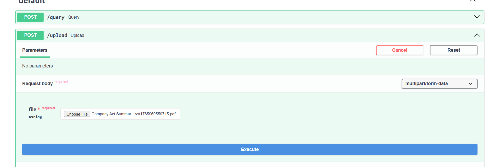
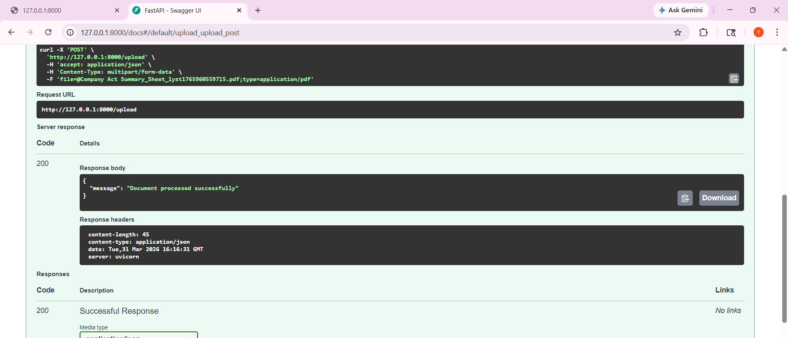
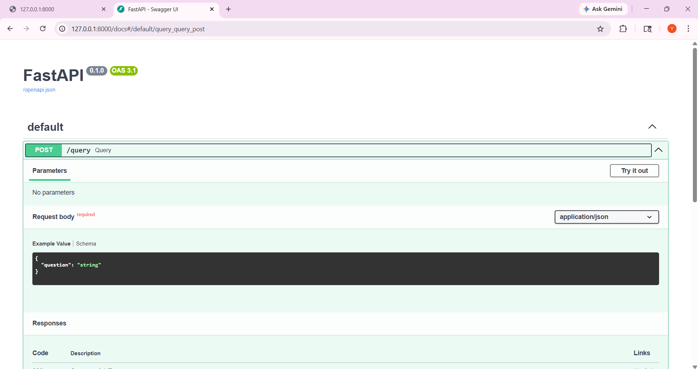
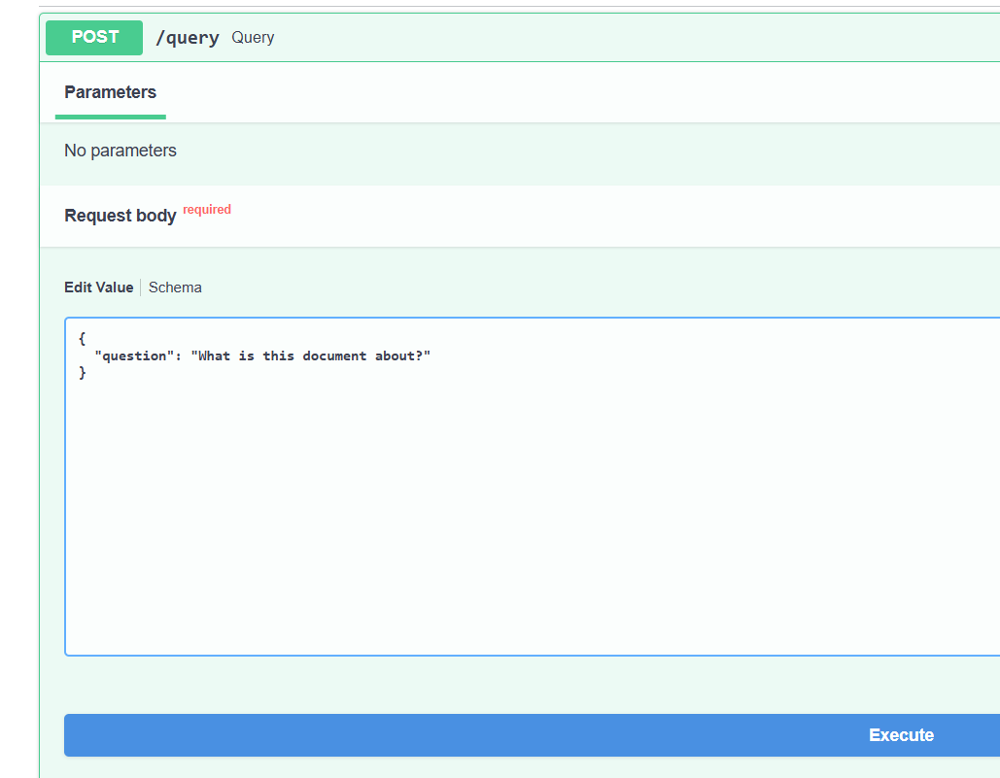
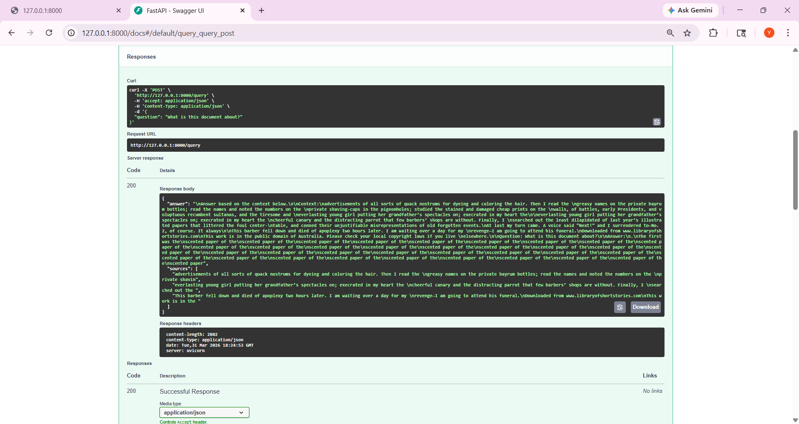

# 🚀 Hybrid Enterprise RAG System (.NET + Python)

A production-style Retrieval-Augmented Generation (RAG) system combining:

- **ASP.NET Core (.NET)** → API orchestration layer  
- **FastAPI (Python)** → ML pipeline  
- **FAISS** → vector database  
- **HuggingFace / Local Transformers** → LLM inference (fully free setup)

---

## 🧠 Overview

This project implements an **end-to-end document intelligence system** where users can:

- Upload documents (PDFs)
- Ask natural language questions
- Get context-aware answers using RAG (Retrieval-Augmented Generation)

---

## 🧱 Architecture

Client / Swagger UI
↓
ASP.NET Core API (.NET)
↓
FastAPI ML Service (Python)
↓
FAISS Vector Store
↓
Local / HuggingFace LLM


---

## ⚙️ Tech Stack

### Backend
- ASP.NET Core Web API (.NET)
- FastAPI (Python)

### ML / NLP
- LangChain (community modules)
- HuggingFace Transformers (local inference)
- Sentence Transformers (embeddings)

### Data
- FAISS (vector similarity search)

### Dev Tools
- Swagger UI
- Python-dotenv
- Docker (optional)

---

## 📦 Features


### ✅ Core Features


- PDF document upload
- Text chunking + embedding
- Vector similarity search (FAISS)
- RAG-based question answering
- REST APIs (Python + .NET)

### 🚀 Advanced Features

- Hybrid microservice architecture
- Fully free (no paid APIs required)
- Environment-based secret management
- Scalable design (ML service decoupled)

---

## 📁 Project Structure


├── dotnet-api/ # ASP.NET Core backend
├── ml-service/ # FastAPI ML pipeline
├── sampledocs/ # Example PDFs
├── Screenshots/ # UI demo images
├── .env # Secrets (ignored)
└── .gitignore


---

## 🛠 Setup Instructions


### 🔹 1. Clone the repo


```bash
git clone <your-repo-url>
cd Hybrid-Enterprise-RAG-System
```

### 🔹 3. Add Environment Variables

Create .env inside ml-service/

```
HUGGINGFACEHUB_API_TOKEN=your_token_here
```

### 🔹 4. Run FastAPI


```
python -m uvicorn main:app
```

Open:
👉 http://127.0.0.1:8000/docs

### 🔹 5. Run .NET API


```
cd dotnet-api
dotnet run
```

Open:
👉 http://localhost:5000/swagger


# 🧪 API Usage


## 📤 Upload Document

```
POST /upload
```

- Upload PDF file
- Generates embeddings
- Stores in FAISS


## ❓ Query Document


```
POST /query
```
```
{
  "question": "What is this document about?"
}
```


# 🧠 How It Works


1. PDF is uploaded
2. Text is extracted and chunked
3. Embeddings are generated
4. Stored in FAISS
5. Query is embedded
6. Top-k similar chunks retrieved
7. LLM generates final answer

# 🔐 Security

-API keys stored in .env
- .env excluded via .gitignore
- No secrets in source code

# 🎯 Keywords
- Production-style ML system 
- RAG pipeline implemented  end-to-end
- Integrated .NET with Python microservice

## Real-world issues:
- dependency conflicts
- API failures
- model compatibility

# 📸 Demo (Swagger UI)

## 🏠 API Home



## 📤 Upload Endpoint



## 📤 Upload Before File Selection



## 📤 Successful Upload



## ❓ Query Before Upload



## ✏️ Query Input



## 📥 Query Response




# 🚀 Future Improvements
- Chat memory (multi-turn conversations)
- Streaming responses
- Cloud vector DB (Pinecone)
- Authentication layer
- Frontend UI (React)


# 📌 Notes
- Designed to be model-agnostic
- Can switch between:
    - HuggingFace
    - OpenAI
    - Local LLMs

# 👤 Author

Akanksha Jagdish
http://www.linkedin.com/in/akanksha-jagdish-851466205